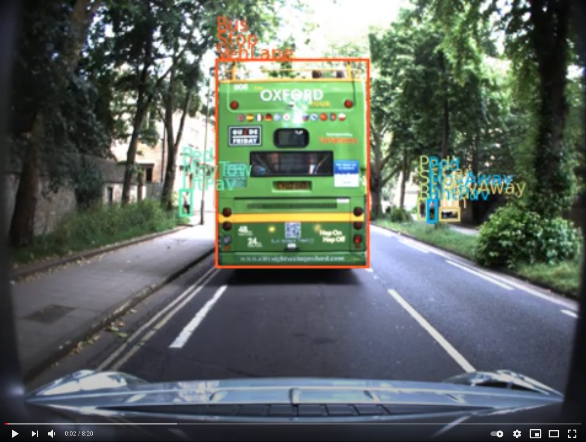

# Download and pre-process ROAD dataset

Here we provide the **download** and **pre-processing instructions** for the ROAD dataset, that is released through our TPAMI paper: [ROAD: The ROad event Awareness Dataset for Autonomous Driving](https://www.computer.org/csdl/journal/tp/5555/01/09712346/1AZL0P4dL1e) and uses [3D-RetinaNet](https://github.com/gurkirt/3D-ReintaNet) code as a **baseline**, which also contains the evaluation code. The ROAD dataset will be used within [The ROAD challenge](https://eval.ai/web/challenges/challenge-page/1059/overview).


## Main Features

- Action annotations for human as well as other road agents, e.g. Turning-right, Moving-away etc. 
- Agent type labels, e.g. Pedestrian, Car, Cyclist, Large-Vehicle, Emergency-Vehicle etc.
- Semantic location labels of the location of agent, e.g. in vehicle lane, in right pavement etc.
- 122K frames from 22 videos annotated, each video is 8 mins long on an average.
- track/tube id annotated for every bounding box on every frame for every agent in the scene.
- 7K tubes/tracks of individual agents.
    - Each tube consists  on  average  of  approximately  80  bounding  boxes linked  over  time.
- 559K bounding  box-level agent  labels.
- 641K and 498K bounding box-level action and location labels.
- 122k annotated with self/ego-actions of AV as well, e.g. AV-on-the-mov, AV-Stopped, AV-turning-right, AV-Overtaking etc.

## Attribution
ROAD dataset is build upon [Oxford Robot Car Dataset (OxRD)](https://robotcar-dataset.robots.ox.ac.uk/about/). If you find the original dataset useful in your work, please cite it using the citation that can be found [here](https://robotcar-dataset.robots.ox.ac.uk/citation/). 

Similar to the original dataset [(OxRD)](https://robotcar-dataset.robots.ox.ac.uk/privacy/), the ROAD dataset is licensed under a [Creative Commons Attribution-NonCommercial-ShareAlike 4.0](http://creativecommons.org/licenses/by-nc-sa/4.0) International License and is intended for non-commercial academic use. If you are interested in using the dataset for commercial purposes, please contact original creator [OxRD](https://robotcar-dataset.robots.ox.ac.uk/contact/) for video content and [Fabio](https://cms.brookes.ac.uk/staff/FabioCuzzolin/) and [Gurkirt](http://gurkirt.github.io/) for event annotations.

If you use ROAD dataset, please cite it using the following:

    @ARTICLE {singh2022road,
    author = {Singh, Gurkirt and Akrigg, Stephen and Di Maio, Manuele and Fontana, Valentina and Alitappeh, Reza Javanmard and Saha, Suman and  Jeddisaravi, Kossar and Yousefi, Farzad and Culley, Jacob and Nicholson, Tom and others},
    journal = {IEEE Transactions on Pattern Analysis & Machine Intelligence},
    title = {ROAD: The ROad event Awareness Dataset for autonomous Driving},
    year = {5555},
    volume = {},
    number = {01},
    issn = {1939-3539},
    pages = {1-1},
    keywords = {roads;autonomous vehicles;task analysis;videos;benchmark testing;decision making;vehicle dynamics},
    doi = {10.1109/TPAMI.2022.3150906},
    publisher = {IEEE Computer Society},
    address = {Los Alamitos, CA, USA},
    month = {feb}
    }
        

## Download

BY DOWNLOADING THE DATASET VIDEOS YOU ARE BOUNDED TO ADHERE TO PRIVACY GUIDELINES OF [OxRD](https://robotcar-dataset.robots.ox.ac.uk/privacy/). PLEASE VISIT [OxRD](https://robotcar-dataset.robots.ox.ac.uk/privacy/) PRIVACY POLICY FOR MORE DETAILS. THE VIDEOS FROM [OxRD](https://robotcar-dataset.robots.ox.ac.uk/privacy/) AND PROVIDED ANNOTATIONS ARE ONLY FOR ACADEMIC PURPOSE. 

We release the annotations created by [Visual Artificial Intelligence Laboratory](https://cms.brookes.ac.uk/staff/FabioCuzzolin/), and the sub-set of pre-processed videos from [OxRD](https://robotcar-dataset.robots.ox.ac.uk/about/). Pre-processing includes `demosaic` for RGB conversion, `ffmpeg` for `.mp4` conversion and fixing the frame-rate. More details can be found in [tar2mp4](./tar2mp4/README.md).

You can download the `Train-Val-set` videos and corresponding annotations by changing your current directory to the road directory and running the bash file [get_dataset.sh](./road/get_dataset.sh). This will automatically download the annotation files and video directory in the current directory (road).
```
bash get_dataset.sh
```
Alternatively, you can download the `Train-Val-set` videos and annotations from [our Google-Drive folder](https://drive.google.com/drive/folders/1hCLlgRqsJBONHgwGPvVu8VWXxlyYKCq-?usp=sharing).


The videos of `Test-set` and annotations are released, you can download it from [our Google-Drive folder](https://drive.google.com/drive/folders/1tHUZ4YnrkMxsxhchMZ6Jt56nNaG9LcBp?usp=sharing).

## Frame-extraction

The **baseline code** for [3D-RetinaNet](https://github.com/gurkirt/3D-ReintaNet) used in the dataset release [paper](https://arxiv.org/pdf/2102.11585.pdf) uses sequences of frames as input. Once you have downloaded the videos from Google-Drive, create a folder name `road` and put the annotations under it, then create another folder named `videos` under `road` folder, and put all the videos under the folder named `videos`. Now, your folder structure should look like this:

```
    road/
        - road_trainval_v1.0.json
        - videos/
            - 2014-06-25-16-45-34_stereo_centre_02
            - 2014-06-26-09-53-12_stereo_centre_02
            - ........

```

Before extracting the frames, you will need to make sure that you have `ffmpeg` installed on your machine or your python should include its binaries. If you are using Ubuntu, the following command should be sufficient: `sudo apt install ffmpeg`.

You can now use `extract_videos2jpgs.py` to extract the frames. You will need to provide the path to the `road` folder as an argument:
```
python extract_videos2jpgs.py <path-to-road-folder>/road/
```

Now, the `road` directory should look like this:

```
    road/
        - road_trainval_v1.0.json
        - videos/
            - 2014-06-25-16-45-34_stereo_centre_02
            - 2014-06-26-09-53-12_stereo_centre_02
            - ........
        - rgb-images
            - 2014-06-25-16-45-34_stereo_centre_02/
                - 00001.jpg
                - 00002.jpg
                - .........*.jpg
            - 2014-06-26-09-53-12_stereo_centre_02
                - 00001.jpg
                - 00002.jpg
                - .........*.jpg
            - ......../
                - ........*.jpg

```
## Annotation Structure

The annotations for the train and validation split are saved in single `json` file named `road_trainval_v1.0.json`, which is located under root directory of the dataset as it can be seen above.

The first level of `road_trainval_v1.0.json` contains dataset level information like classes of each label type:

- Here are all the fields: `dict_keys(['all_input_labels', 'all_av_action_labels', 'av_action_labels', 'agent_labels', 'action_labels', 'duplex_labels', 'triplet_labels', 'loc_labels', 'db', 'label_types', 'all_duplex_labels', 'all_triplet_labels', 'all_agent_labels', 'all_loc_labels', 'all_action_labels', 'duplex_childs', 'triplet_childs'])`
- `all_input_labels`: All classes used to annotate the dataset
- `label_types` :  It is list of all the label types `['agent', 'action', 'loc', 'duplex', 'triplet']`.
- `all_av_action_labels`: All classes used to annotate AV actions
- `av_action_labels`: Classes finally being used for AV actions
-  Remaining fields ending with `labels` follows the same logic and AV actions described in above line.
- `duplex_childs` and `triplet_childs` contain ids of child classes form `agent`, `action` or `location` labels to construct `duplex` or `triplet` labels, 
- `duplex` is constructed using `agent` and `action` classes.
- `event` or `triplet` is constructed  using `agent`, `action`, and `location` classes.

Finally, the `db` field contains all `frame` and `tube` level annotations for all the videos:

- To access annotation for a vides, use db['2014-06-25-16-45-34_stereo_centre_02'], where `'2014-06-25-16-45-34_stereo_centre_02'` is name of a video.
- Each video annotation comes with following fields
    - `['split_ids', 'agent_tubes', 'action_tubes', 'loc_tubes', 'duplex_tubes', 'triplet_tubes', 'av_action_tubes', 'frame_labels', 'frames', 'numf']`
    - `split_ids` contains the split id assigned this videos out of `'test', 'train_1','val_1',........'val_3'`. 
    - `numf` is number of frames in the video.
    - `frame_labels` is AV-action class ids assigned for each frame of the videos. 
    - `frames` contains frame-level annotations
        - for the each frame of the video, e.g. for `'1'` frame, frames['1'] contains `['annotated', 'rgb_image_id', 'width', 'height', 'av_action_ids', 'annos', 'input_image_id']`
        - `annotated` is flag to indicate if frame is annotated or not.
        - `rgb_image_id` = `input_image_id` is id of physical frame extracted by ffmpeg.
        - `av_action_ids`: AV action labels
        - `annos` : contains annotations of a frame with bounding boxes with unique keys like `annos['4585'] =['b19111',]` from a frame number `'4585'`, which is unique in whole dataset.
        - `annos['b09']` has following keys `dict_keys(['box', 'agent_ids', 'loc_ids', 'action_ids', 'duplex_ids', 'triplet_ids', 'tube_uid'])`
            - `box` is normalized (0,1) bounding box coordinate with `xmin, ymin, xmax, ymax`
            - `tube_uid` id of the agent tube it belongs.
            - fields ending with `_ids` contains class ids of respective label type.
    - The fields ending `tubes` contains tube-level annotation of respective label-type. 
        - for example, `db['2014-06-25-16-45-34_stereo_centre_02']['agent_tubes']` contains tubes with fields like `['544e13cc-001-01', 'a074d1bf-001-01', 'e97b3e4c-001-01', 'edb6d66a-005-01', .........]`
        - each tube has following fields `dict_keys(['label_id', 'annos'])`
            - `label_id` is class id from respective label type.
            - `annos` is dictinary with keys made of frame_ids, e.g. `['agent_tubes']['10284a58-002-01']['annos'].keys()` >> `dict_keys(['4585', '4586', ......, '4629', '4630'])`
            - `annos['4585'] = 'b19111'` stores unique key which points to frame-level annotations in frame number '4585'.

## Evaluation

Now that you have the dataset and are familiar with its structure, you are ready to train or test [3D-RetinaNet](https://github.com/gurkirt/3D-ReintaNet), which contains a dataloader class and evaluation scripts required for all the tasks in ROAD dataset. 

You can find the **evaluation** functions in [3D-RetinaNet/modules/evaluation.py](https://github.com/gurkirt/3D-RetinaNet/blob/master/modules/evaluation.py).

## Plotting annotations
Please **note** that you need to setup the dataset structure like it is set in the [Frame-extraction](#Frame-extraction) section!
In order to inspect the dataset, you can use `plot_annots.py` to plot the annotations for the videos in `road/rgb-images/`. This will dump plotted images, then you can use `ffmpeg` to convert them into a [video](https://youtu.be/5rWeFtprJuQ) like shown below:

[](https://www.youtube.com/watch?v=5rWeFtprJuQ "Road-dataset sample with annotations")
